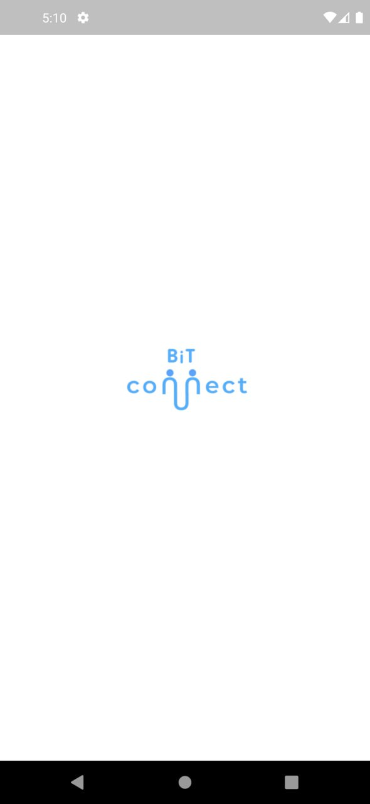
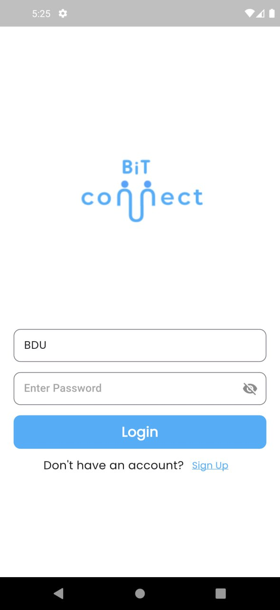
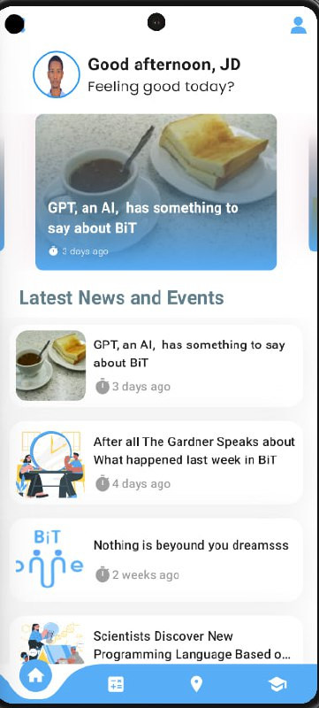
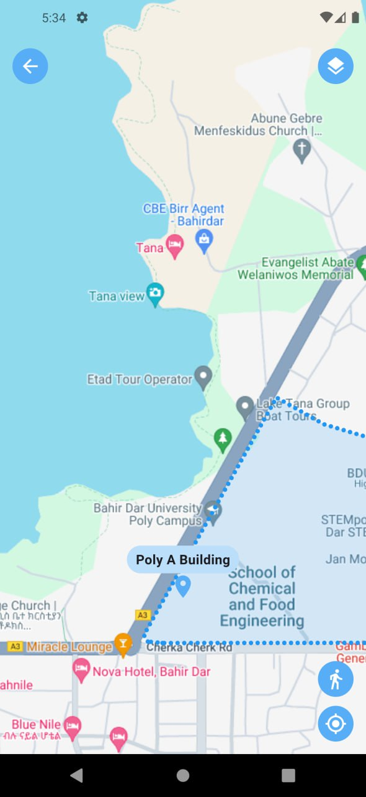

# BiT Connect

BiT Connect is an upcoming app designed exclusively for students at BDU. With a range of useful features, including:

- Access to BDU SIMS

- Cafe menus
- Indoor map services
- A class schedule with a notification system
- Updates on recent events

BiT Connect is your go-to app for navigating campus life at Bahir Dar University. Stay tuned as BiT Connect is currently in development and will be available on app stores soon.

## To do 📑: 

- Getting Info about indoor lounges and outdoor food places
- Class schedule with notification system

## Prerequisites 📜:

**1.** [Visual Studio Code (VS Code)](https://code.visualstudio.com/)

**2.** [Flutter SDK](https://flutter.dev/docs/get-started/install)

**3.** [Flutter Plugin for VS Code](https://flutter.dev/docs/get-started/editor?tab=vscode)

**4.** [Dart SDK](https://dart.dev/get-dart)

**5.** [Java Development Kit (JDK)](https://www.oracle.com/java/technologies/javase-jdk11-downloads.html)

**6.** [Android Studio](https://developer.android.com/studio)

## Project Setup ⚙️

Want to add your project to the repo? We invite you to contribute.
To start contributing, follow the below guidelines: 

**1.** Fork [this](https://github.com/Lit-coders/BIT-Connect) repository.

**2.** Open [VS Code](https://code.visualstudio.com/) and clone your forked copy of the project.

```
git clone https://github.com/Lit-coders/BIT-Connect.git
```

**3.** Navigate to the project directory **BiT-Connect**:

```
cd BiT-Connect
```

**4.** Run the following command to install the dependencies:

```
flutter pub get
```
**5.** Run the project:

```
flutter run
```

You're good to go 😊

## Images 📷📷 :

<a></a>
<a></a>
<a></a>
<a></a>
<a></a>

## Contributors👩‍💻👨‍💻 :

<div align = "center">
<a href="https://github.com/abkodes">
  
</a>
<a href="https://github.com/melat369">
  
</a>
<a href="https://github.com/dagimg-dot">
  
</a>
<a href="https://github.com/Jeremi-code">
  
</a>
<a href="https://github.com/NathnaelTB">
  
</a>
<a href="https://github.com/sgc93">
  
</a>
</div>
